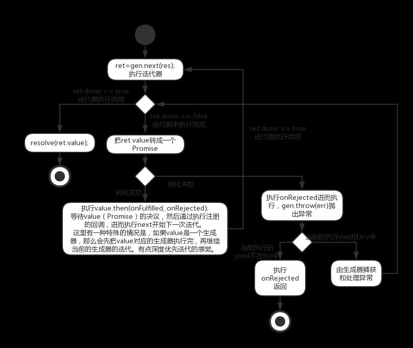

### 源码

```javascript

/**
 * slice() reference.
 */

var slice = Array.prototype.slice; // 返回一个新的数组对象，这一对象由begin和end索引组成（不含end）。原数组不含被改变

/**
 * Expose `co`.
 * 导出co函数
 */

module.exports = co['default'] = co.co = co;

/**
 * Wrap the given generator `fn` into a function that returns a promise.
 * 把给定的 生成器函数 fn 包裹在promise 函数里面并返回
 * This is a separate function so that every `co()` call doesn't create a new,unnecessary closure.
 * 这是一个单独的函数，所以每个 'co()'  调用 不会被新建，也不必要闭包
 *
 * @param {GeneratorFunction} fn
 * @return {Function}
 * @api public
 */

co.wrap = function (fn) {
  // 包裹一个generatorFunction，保存，后面执行
  createPromise.__generatorFunction__ = fn;
  return createPromise;
  function createPromise() {
    return co.call(this, fn.apply(this, arguments));
  }
};

/**
 * Execute the generator function or a generator and return a promise.
 * 执行这个生成器或者生成器函数，并返回一个promise
 *
 * @param {Function} fn
 * @return {Promise}
 * @api public
 */

function co(gen) {
  var ctx = this; // 保存上下文
  var args = slice.call(arguments, 1); // 常见的收集剩余参数

  // we wrap everything in a promise to avoid promise chaining,
  // 我们包裹所有东西在一个promise之中去避免promise变化
  // which leads to memory leak errors.
  // 这个导致内存泄漏的错误
  // see https://github.com/tj/co/issues/180
  return new Promise(function(resolve, reject) {
    /* 
      gen是函数说明是一个生成器函数，此时，执行生成器函数返回一个迭代器
      如果gen不是一个函数，则一般情况下是一个迭代器，否则直接resovle该值返回
    */

    if (typeof gen === 'function') gen = gen.apply(ctx, args); // 把gen(...args)的方式转换为简写,方便下面的gen.next()
    if (!gen || typeof gen.next !== 'function') return resolve(gen);


    // 迭代器开始自动执行
    onFulfilled();

    /**
     * @param {Mixed} res
     * @return {Promise}
     * @api private
     */

    function onFulfilled(res) {
      var ret;
      try {
        // 执行到yield语句，返回yield语句右边的值，传入的res是上一个yield右边对应的Promise决议的值
        ret = gen.next(res);
      } catch (e) {
        // 出错则reject
        return reject(e);
      }
      // 已yield返回值为参数，执行next，进行下一次的迭代
      next(ret);
      return null;
    }

    /**
     * @param {Error} err
     * @return {Promise}
     * @api private
     */

    function onRejected(err) {
      var ret;
      try {
        // 抛出异常，如果当前的yield在try中，则该异常由生成器内部捕获处理，否则由onRejected函数处理
        ret = gen.throw(err);
      } catch (e) {
        return reject(e);
      }
      next(ret);
    }

    /**
     * Get the next value in the generator,return a promise.
     * 获得next方法返回的value，并返回一个promise
     *
     * @param {Object} ret
     * @return {Promise}
     * @api private
     */

    function next(ret) {
      // 迭代器执行完毕则返回，把value resolve出去
      if (ret.done) return resolve(ret.value);
      // 把yield返回的值，也就是迭代器返回的值转成Promise
      var value = toPromise.call(ctx, ret.value);
      if (value && isPromise(value)) return value.then(onFulfilled, onRejected);
      return onRejected(new TypeError('You may only yield a function, promise, generator, array, or object, '
        + 'but the following object was passed: "' + String(ret.value) + '"'));
    }
  });
}

/**
 * Convert a `yield`ed value into a promise.
 * 把yield返回的值，也就是迭代器返回的值转成Promise
 * @param {Mixed} obj
 * @return {Promise}
 * @api private
 */
// 把obj转成Promise
function toPromise(obj) {
  if (!obj) return obj;
  if (isPromise(obj)) return obj;
  // 如果是一个生成器或者生成器函数，则进行co
  if (isGeneratorFunction(obj) || isGenerator(obj)) return co.call(this, obj);
  if ('function' == typeof obj) return thunkToPromise.call(this, obj);
  if (Array.isArray(obj)) return arrayToPromise.call(this, obj);
  if (isObject(obj)) return objectToPromise.call(this, obj);
  return obj;
}

/**
 * Convert a thunk to a promise.
 *
 * @param {Function}
 * @return {Promise}
 * @api private
 */
/*
  把thunk函数转成Promise，thunk函数具体可参考thunkify库，
  实际是一个偏函数，最后一个参数需要一个回调,如下代码所示。
*/
function thunkToPromise(fn) {
  var ctx = this;
  return new Promise(function (resolve, reject) {
    /*
      fn是一个偏函数，里面包裹这一个异步函数，此时他还需要最后一个参数，也就是回调函数。
      如果不调用回调则该Promise无法决议。执行fn的时候，一般是一个异步的操作，比如readFile读取文件，
      然后读取完毕后会执行回调，在回调了执行该Promise的resolve或者reject
    */
    fn.call(ctx, function (err, res) {
      if (err) return reject(err);
      if (arguments.length > 2) res = slice.call(arguments, 1);
      resolve(res);
    });
  });
}

/**
 * Convert an array of "yieldables" to a promise.
 * Uses `Promise.all()` internally.
 *
 * @param {Array} obj
 * @return {Promise}
 * @api private
 */

function arrayToPromise(obj) {
  // 把数组里的每个元素都转成Promise，Promise.all等待该数组中的所有的Promise决议
  return Promise.all(obj.map(toPromise, this));
}

/**
 * Convert an object of "yieldables" to a promise.
 * Uses `Promise.all()` internally.
 *
 * @param {Object} obj
 * @return {Promise}
 * @api private
 */

function objectToPromise(obj){
  var results = new obj.constructor();
  var keys = Object.keys(obj);
  var promises = [];
  for (var i = 0; i < keys.length; i++) {
    var key = keys[i];
    var promise = toPromise.call(this, obj[key]);
    // 把对象的值转成Promise，如果不能转，则直接记录该值
    if (promise && isPromise(promise)) defer(promise, key);
    else results[key] = obj[key];
  }
  return Promise.all(promises).then(function () {
    // 等待所有Promise的决议，然后返回results
    return results;
  });

  function defer(promise, key) {
    // predefine the key in the result
    results[key] = undefined;
    promises.push(promise.then(function (res) {
      results[key] = res;
    }));
  }
}

/**
 * Check if `obj` is a promise.
 *
 * @param {Object} obj
 * @return {Boolean}
 * @api private
 */

function isPromise(obj) {
  return 'function' == typeof obj.then;
}

/**
 * Check if `obj` is a generator.
 *
 * @param {Mixed} obj
 * @return {Boolean}
 * @api private
 */

function isGenerator(obj) {
  return 'function' == typeof obj.next && 'function' == typeof obj.throw;
}

/**
 * Check if `obj` is a generator function.
 *
 * @param {Mixed} obj
 * @return {Boolean}
 * @api private
 */
 
function isGeneratorFunction(obj) {
  var constructor = obj.constructor;
  if (!constructor) return false;
  if ('GeneratorFunction' === constructor.name || 'GeneratorFunction' === constructor.displayName) return true;
  return isGenerator(constructor.prototype);
}

/**
 * Check for plain object.
 *
 * @param {Mixed} val
 * @return {Boolean}
 * @api private
 */

function isObject(val) {
  return Object == val.constructor;
}
```
### 逻辑图




### 原理

Generator 函数的暂停执行的效果，意味着可以把异步操作写在`yield`表达式里面，等到调用`next`方法时再往后执行。这实际上等同于不需要写回调函数了，因为异步操作的后续操作可以放在`yield`表达式下面，反正要等到调用`next`方法时再执行。所以，Generator 函数的一个重要实际意义就是用来处理异步操作，改写回调函数。

前面说过，Generator 就是一个异步操作的容器。它的自动执行需要一种机制，当异步操作有了结果，能够自动交回执行权。


```javascript
function* main() {
  var result = yield request("http://some.url");
  var resp = JSON.parse(result);
    console.log(resp.value);
}

function request(url) {
  makeAjaxCall(url, function(response){
    it.next(response); // 此调用会在genarator函数的对应的yield，将其变成response这个值
  });
}

var it = main();
it.next(); // 这里调用会执行到暂停右上部分，就是执行到第一个yield的右上部，
// 下一次执行next加上值时，会把值带入这个yield
```

正常异步会写成下面模样。
co模块，是将我们手动next的方法放在了自己封装的函数返回的promise之中，这样子变相变成了自调用


```javascript
var fs = require('fs');

var readFile = function (fileName){
  return new Promise(function (resolve, reject){
    fs.readFile(fileName, function(error, data){
      if (error) return reject(error);
      resolve(data);
    });
  });
};

var gen = function* (){
  var f1 = yield readFile('/etc/fstab');
  var f2 = yield readFile('/etc/shells');
  console.log(f1.toString());
  console.log(f2.toString());
};

```

