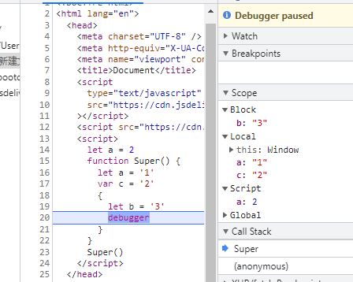
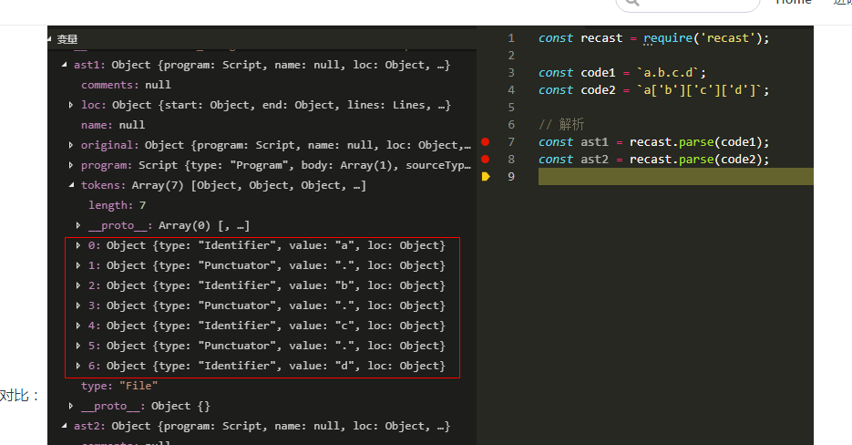

### 第 1 题：`['1', '2', '3'].map(parseInt)` what & why ?

```js
//首先 map 会想parseInt传入 参数 value ，index ，array
// 而parseInt 只能接受两个参数string ， radix 基数 从给定字符串中解析的整数。如果基数小于11，且第一个非空白字符不能转换为数字，则返回NaN。
// radix 2-32之间，
//如果字符串 string 以"0x"或者"0X"开头, 则基数是16 (16进制).
//如果字符串 string 以"0"开头, 基数是8（八进制）或者10（十进制），那么具体是哪个基数由实现环境决定。ECMAScript 5 规定使用10，但是并不是所有的浏览器都遵循这个规定。因此，永远都要明确给出radix参数的值。
//如果字符串 string 以其它任何值开头，则基数是10 (十进制)。
//所以得出 1 ,NAN ,NaN

//如果要得到转换的数字应该使用Number
['1','2','3'].map(Number)
```

### 第 2 题：什么是防抖和节流？有什么区别？如何实现？

#### 防抖

动作绑定事件，动作发生后一定时间后触发该事件，如果该动作又发生，则重新等待一定时间再触发事件

```javascript
function debounce(fn,timer=500){
  let timer = null
  return ()=>{
    clearTimeout(timer)
    timer = setTimeour(()=>{
      fn.apply(this,arguments)
      timer = null
    },time)
  }
}
```

#### 节流

动作绑定的事件，动作发生一段时间后触发事件，如果期间又有动作发生，则无视该动作，直到事件执行完成。

```javascript
function throtter(fn,time=500){
  let timer = null
  return ()=>{
    if(timer === null){
      fn.apply(this,arguments)
      timer = setTimeout(()=>{
        clearTimeOut(timer)
        timer = null
      },time)
    }
  }
}
```

### 第 3 题：介绍下 Set、Map、WeakSet 和 WeakMap 的区别？

Set用于数据重组，一种叫做集合的数据结构

Map用于数据储存，一种叫做字典的数据结构

#### 集合Set

Es6新增的数据结构，类似数组，但成员是唯一且无序的，没有重复的值

```javascript
new Set([iterable])
// 去重数组重复对象
let arr = [1,2,2,2,3,4,5,6]
[...new Set(arr)] // Array.from(new Set(arr)) from方法会把set转换为数组

// 向Set加入值的时候，不会发生类型转换，所以5，‘5’是两个不同的值。Set内部判断两个值是否不同，使用的算法叫做`Same-value-zero-equality`，它类似于精确相等（===），主要区别是NaN等于自身
let set = new Set()
let a =  NaN
let b = NaN
set.add(a)
set.add(b)
log(set) // Set{NaN}

// 实例属性
let set  = new Set([1,2,3])
console.log(set.length)	// undefined
console.log(set.size)	// 3

// 实例方法
// 操作方法
	add(value)//新增
    delete(value)// 删除
    has(value)//判断集合中是否存在value
    clear() //清空集合
// 遍历方法(遍历顺序为插入顺序)Set中键与值相等
    keys()//返回一个包含集合中所有键的迭代器 
    values()//返回一个包含集合中所有值的迭代器
    entries()//返回一个包含Set对象所有元素的键值对迭代器
    let set = new Set([1, 2, 3]);
      console.log(set.keys()); // SetIterator {1, 2, 3}
      console.log(set.values()); // SetIterator {1, 2, 3}
      console.log(set.entries()); // SetIterator {1, 2, 3}

      for (let item of set.keys()) {
        console.log(item);
      } // 1	2	 3
      for (let item of set.entries()) {
        console.log(item);
      } // [1, 1]	[2, 2]	[3, 3]

      set.forEach((value, key) => {
        console.log(key + " : " + value);
      }); // 1 : 1	2 : 2	3 : 3
      console.log([...set]); // [1, 2, 3]
// Set 可默认遍历，默认迭代器生成函数是Values()方法
Set.prototype[Symbol.iterator] === Set.prototype.values // true
// 所以 Set可以使用Map，filter方法
let set = new Set([1, 2, 3])
set = new Set([...set].map(item => item * 2))
console.log([...set])	// [2, 4, 6]

set = new Set([...set].filter(item => (item >= 4)))
console.log([...set])	//[4, 6]
// set实现交集（intersect）并集（Union）差集（difference）
let set1 = new Set([1,2,3])
let set2 = new Set([4,3,2])
let intersect = new Set([...set1].filter(v=>set2.has(v)))
let union = new Set([...set1,...set2])
let difference = new Set([...set1].filter(v=>!set2.has(v)))
```

#### WeakSet-

WeakSet对象允许你将**弱引用对象**存储在一个集合中

weakSet和set的区别

+ weakset只能存储对象引用，不能存放值，而set对象都可以存储
+ weakset对象中存储的对象值都是被弱引用，即垃圾回收机制不考虑weakset中的引用，如果没有其他的变量或者属性引用这个对象值，则这个对象将会被垃圾回收掉，所以weakset对象里面有多少个元素，取决于垃圾回收机制有没有运行，运行前后成员个数可能不一致，遍历结束后，有的成员可能娶不到了（被垃圾回收了），weakSet对象是无法遍历的，也没有办法拿到他包含的所有元素

```javascript
//操作方法
add(value)：在WeakSet 对象中添加一个元素value
has(value)：判断 WeakSet 对象中是否包含value
delete(value)：删除元素 value
clear()：清空所有元素，注意该方法已废弃
var ws = new WeakSet()
var obj = {}
var foo = {}

ws.add(window)
ws.add(obj)

ws.has(window)	// true
ws.has(foo)	// false

ws.delete(window)	// true
ws.has(window)	// false
```

#### 字典（Map）

集合和字典的区别

+ 公共点：集合、字典可以存储不重复的值
+ 不同点：集合是以[value,value]的形式存储元素，字典是以[key,value]形式存储

```javascript
//由上可知，Map 的键实际上是跟内存地址绑定的，只要内存地址不一样，就视为两个键。这就解决了同名属性碰撞（clash）的问题，我们扩展别人的库的时候，如果使用对象作为键名，就不用担心自己的属性与原作者的属性同名。
//如果 Map 的键是一个简单类型的值（数字、字符串、布尔值），则只要两个值严格相等，Map 将其视为一个键，比如0和-0就是一个键，布尔值true和字符串true则是两个不同的键。另外，undefined和null也是两个不同的键。虽然NaN不严格相等于自身，但 Map 将其视为同一个键。


//实例属性
map.size //2

//操作方法
set()
get()//get方法无法读取该键，返回undefined。
has()
delete()
clear()

// 遍历方法
keys()//返回所有的健名
values()//返回所有的值
entries()// 返回所有的键值对
forEach()//遍历字典的所有成员

第 26 题：介绍模块化发展历程
第 27 题：全局作用域中，用 const 和 let 声明的变量不在 window 上，那到底在哪里？如何去获取？
第 33 题：下面的代码打印什么内容，为什么？
第 34 题：简单改造下面的代码，使之分别打印 10 和 20。
第 41 题：下面代码输出什么
第 43 题：使用 sort() 对数组 [3, 15, 8, 29, 102, 22] 进行排序，输出结果
第 46 题：输出以下代码执行的结果并解释为什么
第 48 题：call 和 apply 的区别是什么，哪个性能更好一些
第 53 题：输出以下代码的执行结果并解释为什么
第 58 题：箭头函数与普通函数（function）的区别是什么？构造函数（function）可以使用 new 生成实例，那么箭头函数可以吗？为什么？
第 65 题： a.b.c.d 和 a['b']['c']['d']，哪个性能更高？
第 66 题：ES6 代码转成 ES5 代码的实现思路是什么
第 72 题： 为什么普通 for 循环的性能远远高于 forEach 的性能，请解释其中的原因。
第 75 题：数组里面有10万个数据，取第一个元素和第10万个元素的时间相差多少
第 76 题：输出以下代码运行结果
第 79 题：input 搜索如何防抖，如何处理中文输入
第 83 题：var、let 和 const 区别的实现原理是什么
第 96 题：介绍下前端加密的常见场景和方法
第 98 题：写出如下代码的打印结果
第 100 题：请写出如下代码的打印结果
第 106 题：分别写出如下代码的返回值
第 108 题：请写出如下代码的打印结果
第 109 题：扩展题，请写出如下代码的打印结果
第 116 题：输出以下代码运行结果
第 120 题：为什么 for 循环嵌套顺序会影响性能？
第 129 题：输出以下代码执行结果
第 130 题：输出以下代码执行结果，大致时间就好（不同于上题）
第 136 题：如何实现骨架屏，说说你的思路
异步 

网络 

浏览器 

框架篇 

编程题 

性能优化 

设计模式 

工程化 

#第 4 题：介绍下 Set、Map、WeakSet 和 WeakMap 的区别？
详细解析入口，新增答案入口：第 4 题


sisterAn commented
Set 和 Map 主要的应用场景在于 数据重组 和 数据储存

Set 是一种叫做集合的数据结构，Map 是一种叫做字典的数据结构

1. 集合（Set）
ES6 新增的一种新的数据结构，类似于数组，但成员是唯一且无序的，没有重复的值。

Set 本身是一种构造函数，用来生成 Set 数据结构。

new Set([iterable])
举个例子：

const s = new Set()
[1, 2, 3, 4, 3, 2, 1].forEach(x => s.add(x))

for (let i of s) {
    console.log(i)	// 1 2 3 4
}

// 去重数组的重复对象
let arr = [1, 2, 3, 2, 1, 1]
[... new Set(arr)]	// [1, 2, 3]
Set 对象允许你储存任何类型的唯一值，无论是原始值或者是对象引用。

向 Set 加入值的时候，不会发生类型转换，所以5和"5"是两个不同的值。Set 内部判断两个值是否不同，使用的算法叫做“Same-value-zero equality”，它类似于精确相等运算符（===），主要的区别是**NaN等于自身，而精确相等运算符认为NaN不等于自身。**

let set = new Set();
let a = NaN;
let b = NaN;
set.add(a);
set.add(b);
set // Set {NaN}

let set1 = new Set()
set1.add(5)
set1.add('5')
console.log([...set1])	// [5, "5"]
Set 实例属性

constructor： 构造函数

size：元素数量

let set = new Set([1, 2, 3, 2, 1])

console.log(set.length)	// undefined
console.log(set.size)	// 3
Set 实例方法

操作方法
add(value)：新增，相当于 array里的push

delete(value)：存在即删除集合中value

has(value)：判断集合中是否存在 value

clear()：清空集合

let set = new Set()
set.add(1).add(2).add(1)

set.has(1)	// true
set.has(3)	// false
set.delete(1)	
set.has(1)	// false
Array.from 方法可以将 Set 结构转为数组

const items = new Set([1, 2, 3, 2])
const array = Array.from(items)
console.log(array)	// [1, 2, 3]
// 或
const arr = [...items]
console.log(arr)	// [1, 2, 3]
遍历方法（遍历顺序为插入顺序）
keys()：返回一个包含集合中所有键的迭代器

values()：返回一个包含集合中所有值得迭代器

entries()：返回一个包含Set对象中所有元素得键值对迭代器

forEach(callbackFn, thisArg)：用于对集合成员执行callbackFn操作，如果提供了 thisArg 参数，回调中的this会是这个参数，没有返回值

let set = new Set([1, 2, 3])
console.log(set.keys())	// SetIterator {1, 2, 3}
console.log(set.values())	// SetIterator {1, 2, 3}
console.log(set.entries())	// SetIterator {1, 2, 3}

for (let item of set.keys()) {
  console.log(item);
}	// 1	2	 3
for (let item of set.entries()) {
  console.log(item);
}	// [1, 1]	[2, 2]	[3, 3]

set.forEach((value, key) => {
    console.log(key + ' : ' + value)
})	// 1 : 1	2 : 2	3 : 3
console.log([...set])	// [1, 2, 3]
Set 可默认遍历，默认迭代器生成函数是 values() 方法

Set.prototype[Symbol.iterator] === Set.prototype.values	// true
所以， Set可以使用 map、filter 方法

let set = new Set([1, 2, 3])
set = new Set([...set].map(item => item * 2))
console.log([...set])	// [2, 4, 6]

set = new Set([...set].filter(item => (item >= 4)))
console.log([...set])	//[4, 6]
因此，Set 很容易实现交集（Intersect）、并集（Union）、差集（Difference）

let set1 = new Set([1, 2, 3])
let set2 = new Set([4, 3, 2])

let intersect = new Set([...set1].filter(value => set2.has(value)))
let union = new Set([...set1, ...set2])
let difference = new Set([...set1].filter(value => !set2.has(value)))

console.log(intersect)	// Set {2, 3}
console.log(union)		// Set {1, 2, 3, 4}
console.log(difference)	// Set {1}
2. WeakSet
WeakSet 对象允许你将弱引用对象储存在一个集合中

WeakSet 与 Set 的区别：

WeakSet 只能储存对象引用，不能存放值，而 Set 对象都可以
WeakSet 对象中储存的对象值都是被弱引用的，即垃圾回收机制不考虑 WeakSet 对该对象的应用，如果没有其他的变量或属性引用这个对象值，则这个对象将会被垃圾回收掉（不考虑该对象还存在于 WeakSet 中），所以，WeakSet 对象里有多少个成员元素，取决于垃圾回收机制有没有运行，运行前后成员个数可能不一致，遍历结束之后，有的成员可能取不到了（被垃圾回收了），WeakSet 对象是无法被遍历的（ES6 规定 WeakSet 不可遍历），也没有办法拿到它包含的所有元素
属性：

constructor：构造函数，任何一个具有 Iterable 接口的对象，都可以作参数

const arr = [[1, 2], [3, 4]]
const weakset = new WeakSet(arr)
console.log(weakset)


方法：

add(value)：在WeakSet 对象中添加一个元素value
has(value)：判断 WeakSet 对象中是否包含value
delete(value)：删除元素 value
clear()：清空所有元素，注意该方法已废弃
var ws = new WeakSet()
var obj = {}
var foo = {}

ws.add(window)
ws.add(obj)

ws.has(window)	// true
ws.has(foo)	// false

ws.delete(window)	// true
ws.has(window)	// false

3. 字典（Map）
集合 与 字典 的区别：

共同点：集合、字典 可以储存不重复的值
不同点：集合 是以 [value, value]的形式储存元素，字典 是以 [key, value] 的形式储存
const m = new Map()
const o = {p: 'haha'}
m.set(o, 'content')
m.get(o)	// content

m.has(o)	// true
m.delete(o)	// true
m.has(o)	// false
任何具有 Iterator 接口、且每个成员都是一个双元素的数组的数据结构都可以当作Map构造函数的参数，例如：

const set = new Set([
  ['foo', 1],
  ['bar', 2]
]);
const m1 = new Map(set);
m1.get('foo') // 1

const m2 = new Map([['baz', 3]]);
const m3 = new Map(m2);
m3.get('baz') // 3
如果读取一个未知的键，则返回undefined。

new Map().get('asfddfsasadf')
// undefined
注意，只有对同一个对象的引用，Map 结构才将其视为同一个键。这一点要非常小心。

const map = new Map();

map.set(['a'], 555);
map.get(['a']) // undefined
上面代码的set和get方法，表面是针对同一个键，但实际上这是两个值，内存地址是不一样的，因此get方法无法读取该键，返回undefined。

由上可知，Map 的键实际上是跟内存地址绑定的，只要内存地址不一样，就视为两个键。这就解决了同名属性碰撞（clash）的问题，我们扩展别人的库的时候，如果使用对象作为键名，就不用担心自己的属性与原作者的属性同名。

如果 Map 的键是一个简单类型的值（数字、字符串、布尔值），则只要两个值严格相等，Map 将其视为一个键，比如0和-0就是一个键，布尔值true和字符串true则是两个不同的键。另外，undefined和null也是两个不同的键。虽然NaN不严格相等于自身，但 Map 将其视为同一个键。

let map = new Map();

map.set(-0, 123);
map.get(+0) // 123

map.set(true, 1);
map.set('true', 2);
map.get(true) // 1

map.set(undefined, 3);
map.set(null, 4);
map.get(undefined) // 3

map.set(NaN, 123);
map.get(NaN) // 123
Map 的属性及方法

属性：

constructor：构造函数

size：返回字典中所包含的元素个数

const map = new Map([
  ['name', 'An'],
  ['des', 'JS']
]);

map.size // 2
操作方法：

set(key, value)：向字典中添加新元素
get(key)：通过键查找特定的数值并返回
has(key)：判断字典中是否存在键key
delete(key)：通过键 key 从字典中移除对应的数据
clear()：将这个字典中的所有元素删除
遍历方法

Keys()：将字典中包含的所有键名以迭代器形式返回
values()：将字典中包含的所有数值以迭代器形式返回
entries()：返回所有成员的迭代器
forEach()：遍历字典的所有成员
const map = new Map([
            ['name', 'An'],
            ['des', 'JS']
        ]);
console.log(map.entries())	// MapIterator {"name" => "An", "des" => "JS"}
console.log(map.keys()) // MapIterator {"name", "des"}

const reporter = {
  report: function(key, value) {
    console.log("Key: %s, Value: %s", key, value);
  }
};

let map = new Map([
    ['name', 'An'],
    ['des', 'JS']
])
map.forEach(function(value, key, map) {
  this.report(key, value);
}, reporter);
// Key: name, Value: An
// Key: des, Value: JS

//Map 转 Object
function mapToObj(map) {
    let obj = Object.create(null)
    for (let [key, value] of map) {
        obj[key] = value
    }
    return obj
}
const map = new Map().set('name', 'An').set('des', 'JS')
mapToObj(map)  // {name: "An", des: "JS"}
 
```

#### WeakMap

weakmap对象是一组键值对的集合，其中键是弱引用对象，而值可以是任意值

注意，weakmap弱引用只是健名，而不是键值。兼职依然是正常引用的

weakmap中，每个键对自己所引用对象的引用都是弱引用，再没有其他引用和该键引用同一对象，这个对象将会被垃圾回收(相应的key则变成无效的)。所以wakMap的key是**不可枚举的**

```javascript
//操作方法
has(key)
get(key)
set(key,value)
delete(key)
```

#### 总结

set：

​	集合，成员唯一，无需且不重复

​	[value,value],键名与键值是一致的

​	可以遍历（keys，values，entries），方法有：add,has,,delete,clear

WeakSet:

​	成员都是对象

​	成员都是弱引用，可以被垃圾回收机制回收，可以用来保存DOM节点，不容易造成内存泄漏

​	不能遍历，方法有：add，has，delete

map

​	本质上是键值对的集合，类似集合

​	可以遍历，方法：set，has，get，delete

wealMap

​	只接受对象作为键名（null除外），不接受其他类型的值作为健名

​	健名是弱引用，键值可以是任意的，键名所指向的对象可以被垃圾回收，此时健名是无效的

​	不能遍历，方法：get，set，has，delete

#### 扩展

```javascript
const data = {};
const element = document.getElementsByClassName('App');

data[element] = 'metadata';
console.log(data['[object HTMLCollection]']) // "metadata"
//但当以一个DOM节点作为对象 data 的键，对象会被自动转化为字符串[Object HTMLCollection]，所以说，Object 结构提供了 字符串-值 对应，Map则提供了 值-值 的对应


```

### 第 4 题：ES5/ES6 的继承除了写法以外还有什么区别？

 ES5 和 ES6 子类 `this` 生成顺序不同。ES5 的继承先生成了子类实例，再调用父类的构造函数修饰子类实例，ES6 的继承先生成父类实例，再调用子类的构造函数修饰父类实例。这个差别使得 ES6 可以继承内置对象。

```javascript
function MyES5Array() {
  Array.call(this, arguments);
}

// it's useless
const arrayES5 = new MyES5Array(3); // arrayES5: MyES5Array {}

class MyES6Array extends Array {}

// it's ok
const arrayES6 = new MyES6Array(3); // arrayES6: MyES6Array(3) []
```

第二种理解

```javascript
ES6
class Super {}
class Sub extends Super {}

const sub = new Sub();

Sub.__proto__ === Super;

ES5
function Super() {}
function Sub() {}

Sub.prototype = new Super();
Sub.prototype.constructor = Sub;

var sub = new Sub();

Sub.__proto__ === Function.prototype;

```

### 第 5 题：介绍模块化发展历程

#### IIFE

使用自执行函数来编写模块化，特点：在一个单独的函数作用域中执行代码，避免遍历冲突。

```javascript
(function(){
  return {
    data :[]
  }
})()
```

#### AMD

使用requirejs来编写模块化，特点是：依赖必须提前声明

```javascript
define('./index.js',function(code){
  // code 就是index.js返回的内容
})
```

#### CMD

使用seaJS来编写模块化，特点：支持动态引入依赖文件

```javascript
defind(function(require,export,module){
  var indexCode = require('index.js')
})

```

#### CommonJS

nodejs中自带的模块化

```javascript
var fs  =  require('fs')
```

#### UMD

兼容AMD，Commonjs模块化语法

#### require.ensure(Webpack)

webpack2.x版本中的代码分割

#### ES Modules

ES6中移入模块化的方法

```javascript
import a from 'a'
```

#### 思维导图

https://www.processon.com/view/link/5c8409bbe4b02b2ce492286a#map


### 第 6 题：全局作用域中，用 const 和 let 声明的变量不在 window 上，那到底在哪里？如何去获取？

let 和const相当于自执行函数，只再自己的函数域中

当直接在页面上定义变量时，var定义的在global上，let const在script上

当在函数级中，var，let const也是在函数上local

当在块级中，var 在相应的函数作用域上，let，const在Block中



### 第 7 题：下面的代码打印什么内容，为什么？

#### IIFE函数特性

```javascript
var b = 10;
(function b() {
   // 内部作用域，会先去查找是有已有变量b的声明，有就直接赋值20，确实有了呀。发现了具名函数 function b(){}，拿此b做赋值；
   // IIFE的函数无法进行赋值（内部机制，类似const定义的常量），所以无效。
  // （这里说的“内部机制”，想搞清楚，需要去查阅一些资料，弄明白IIFE在JS引擎的工作方式，堆栈存储IIFE的方式等）
    b = 20;
    console.log(b); // [Function b]//当存在var时，打印出20
    console.log(window.b); // 10，不是20
})();
```

#### 简单改造下面的代码，使之分别打印 10 和 20。

```javascript
     var b = 10;
(function b(){
    b = 20;
    console.log(b); 
})();

var b = 10;
      (function b() {
        var b = 20; //or let b = 20;
        console.log(this);//自执行函数this指向window
        console.log(this.b);
        console.log(b);
      })();
```

#### 输出以下代码执行的结果并解释为什么

```javascript
var obj = {
    '2': 3,
    '3': 4,
    'length': 2,
    'splice': Array.prototype.splice,
    'push': Array.prototype.push
}
obj.push(1)
obj.push(2)
console.log(obj)

//2: 1 //push 是按length  类似arr[length]赋值
//3: 2 //
//length: 4  // 每次push都会增加length
//push: ƒ push()
//splice: ƒ splice() // splice方法也是
Array.from()、splice()、concat()等 题分析： 这个obj中定义了两个key值，分别为splice和push分别对应数组原型中的splice和push方法，因此这个obj可以调用数组中的push和splice方法，调用对象的push方法：push(1)，因为此时obj中定义length为2，所以从数组中的第二项开始插入，也就是数组的第三项（下表为2的那一项），因为数组是从第0项开始的，这时已经定义了下标为2和3这两项，所以它会替换第三项也就是下标为2的值，第一次执行push完，此时key为2的属性值为1，同理：第二次执行push方法，key为3的属性值为2。此时的输出结果就是： Object(4) [empty × 2, 1, 2, splice: ƒ, push: ƒ]----> [ 2: 1, 3: 2, length: 4, push: ƒ push(), splice: ƒ splice() ]

```


```javascript
var a = {n: 1};
var b = a;
a.x = a = {n: 2}; // 先走 a.x = {n:2} 再走 a = {n:2}覆盖原有对象

console.log(a.x) // undefind
console.log(b.x) // {n:2}
. 的优先级高于 = 的优先级
= 具有右结合性（执行的方向是从右往左，先执行 = 右边的表达式，然后把结果赋值给 = 左边的表达式，从这里可以得出 = 属于二元操作符），多个 = 的执行过程，可以类比成"递归"的过程
```


#### 。。。随时补充

### 第 8 题：有以下 3 个判断数组的方法，请分别介绍它们之间的区别和优劣

#### Object.prototype.toString.call()

`Object.prototype.toString.call()` 常用于判断浏览器内置对象时。

```javascript
Object.prototype.toString.call('An') // "[object String]"
Object.prototype.toString.call(1) // "[object Number]"
Object.prototype.toString.call(Symbol(1)) // "[object Symbol]"
Object.prototype.toString.call(null) // "[object Null]"
Object.prototype.toString.call(undefined) // "[object Undefined]"
Object.prototype.toString.call(function(){}) // "[object Function]"
Object.prototype.toString.call({name: 'An'}) // "[object Object]"
//每一个继承 Object 的对象都有 toString 方法，如果 toString 方法没有重写的话，会返回 [Object type]，其中 type 为对象的类型。但当除了 Object 类型的对象外，其他类型直接使用 toString 方法时，会直接返回都是内容的字符串，所以我们需要使用call或者apply方法来改变toString方法的执行上下文。
```

#### instanceof

`instanceof`  的内部机制是通过判断对象的原型链中是不是能找到类型的 `prototype`。

```javascript
[]  instanceof Array; // true
[]  instanceof Object; // true
```

#### Array.isArray()

用来判断对象是否为数组

```javascript
if (!Array.isArray) {
  Array.isArray = function(arg) {
    return Object.prototype.toString.call(arg) === '[object Array]';
  };
}
```

#### typeof 

typeof 只能检测 基本数据类型，包括boolean、undefined、string、number、symbol，而null ,Array、function、Object ,使用typeof出来都是Objec。无法检测具体是哪种引用类型。


### 第 9 题：箭头函数与普通函数（function）的区别是什么？构造函数（function）可以使用 new 生成实例，那么箭头函数可以吗？为什么？

- 普通使用时，箭头函数体现的更加简洁
- 箭头函数的this在定义时的对象，而不是使用时的对象
- 不能使用argument对象，该对象在函数体内不存。需要是 使用rest 参数代替
- 不可以使用yield 命令，也不能作为Generator函数， `yield` 关键字通常不能在箭头函数中使用（除非是嵌套在允许使用的函数内）。因此，箭头函数不能用作函数生成器。
- 不能使用new 命令，1.没有this，无法调用call，apply，没有prototype属性，而new命令执行时，需要将构造函数的prototype属性的赋值给实例的--proto-- 也没有new.target 和super

```javascript
function New(Ctor, ...rest) {
  const o = Object.create(Ctor.prototype)
  const ret = Ctor.apply(o, rest)
  return ret || o
}
```

### 第 10 题： `a.b.c.d` 和 `a['b']['c']['d']`，哪个性能更高？

应该是 `a.b.c.d` 比 `a['b']['c']['d']` 性能高点，后者还要考虑 `[ ]` 中是变量的情况，再者，从两种形式的结构来看，显然编译器解析前者要比后者容易些，自然也就快一点

#### AST抽象语法树（待补充）

https://www.npmjs.com/package/recast



```javascript
function add(a, b) {
return a + b
}


1.用力拆开，它成了三块：

一个id，就是它的名字，即add
两个params，就是它的参数，即[a, b]
一块body，也就是大括号内的一堆东西
add没办法继续拆下去了，它是一个最基础Identifier（标志）对象，用来作为函数的唯一标志，就像人的姓名一样。
{
name: 'add'
type: 'identifier'
...
}


2.params继续拆下去，其实是两个Identifier组成的数组。之后也没办法拆下去了。

[
{
name: 'a'
type: 'identifier'
...
},
{
name: 'b'
type: 'identifier'
...
}
]

3.接下来，我们继续拆开body
我们发现，body其实是一个BlockStatement（块状域）对象，用来表示是{return a + b}
打开Blockstatement，里面藏着一个ReturnStatement（Return域）对象，用来表示return a + b
继续打开ReturnStatement,里面是一个BinaryExpression(二项式)对象，用来表示a + b
继续打开BinaryExpression，它成了三部分，left，operator，right
operator 即+
left 里面装的，是Identifier对象 a
right 里面装的，是Identifer对象 b

就这样，我们把一个简单的add函数拆解完毕。抽象语法树(Abstract Syntax Tree)，的确是一种标准的树结构。

run: 通过命令行读取js文件，并转化成ast以供处理。
tnt： 通过assert()和check()，可以验证ast对象的类型。
visit: 遍历ast树，获取有效的AST对象并进行更改。
你想操作函数声明，就使用visitFunctionDelaration遍历，想操作赋值表达式，就使用visitExpressionStatement。 只要在 AST对象文档中定义的对象，在前面加visit，即可遍历。visitExportNamedDeclaration导出对象
return false 每个遍历函数后必须加上return false
或者选择以下写法，否则报错：

#!/usr/bin/env node
const recast = require('recast')

recast.run(function(ast, printSource) {
recast.visit(ast, {
visitExpressionStatement: function(path) {
const node = path.node
printSource(node)
this.traverse(path)
}
})
});

builder
print

```


递归读取项目文件 -> 读文件 -> AST 操作 -> 写文件

```javascript
fs.readFile //递归读取项目文件 
const code = data.toString();
console.log(code);
const ast = recast.parse(code); //解析为ast
recast.visit(ast, {
			visitExportNamedDeclaration: function(path) {//遍历导出
              visitVariableDeclaration// 遍历var遍历
              return false
```

